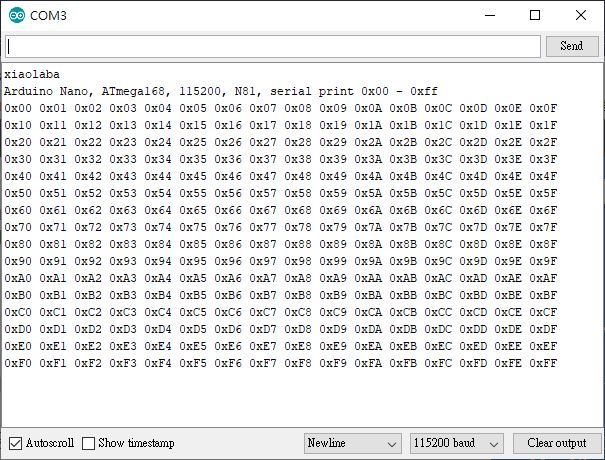

### ATmega328_usart_print0xff
 * UART, dump 0x00 to 0xff to terminal  
 * hardware, Arduino Nano, Atmega168p/328p, 16MHz XTAL  
 * compiler, Arduino IDE 1.8.9 or, avr-gcc  
 * xiaolaba  * 2020-JAN-24

For loop and loop counter, specify "short"
count 0 -255

problem and solution.  
https://xiaolaba.wordpress.com/2015/05/28/arduino-why-c-code-and-problem-for-loop/  

  
### result  
  

